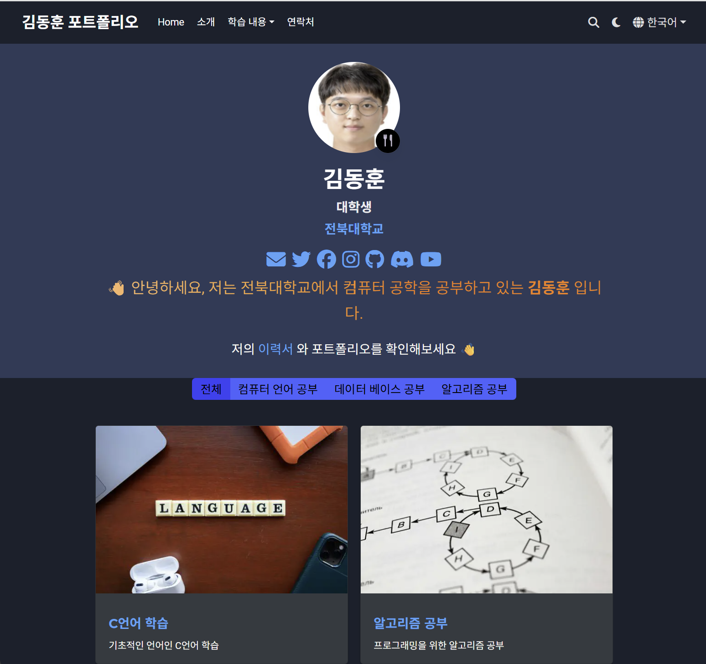

# 김동훈의 포트폴리오 웹사이트

이 프로젝트는 **Hugo**와 **Wowchemy Hugo Portfolio Theme**를 사용하여 구축된 김동훈 개인 포트폴리오 사이트입니다.

[🚀 웹사이트 바로가기](https://donghun712.github.io/)  



---

## ✨ 주요 기술 스택

- **Framework**: Hugo  
- **Theme**: Wowchemy Hugo Portfolio Theme  
- **배포**: GitHub Pages  

---

## 📂 프로젝트 구조

```
.
├── content/        # Markdown 기반 콘텐츠 (페이지, 프로젝트, 블로그)
├── config/         # Hugo 설정 파일 (_default/config.toml, params.toml 등)
├── static/         # 정적 자산 (이미지, CSS, JS)
├── layouts/        # 레이아웃 커스텀 오버라이드
├── resources/      # 처리된 리소스 (최적화된 이미지 등)
└── data/           # 사이트 데이터 (메뉴, 소셜 링크 등)
```

---

## 🚀 로컬 개발 환경

### 사전 준비

- Hugo 설치 가이드: https://gohugo.io/getting-started/installation/

### 실행 방법

```bash
git clone https://github.com/donghun712/donghun712.github.io.git
cd donghun712.github.io
hugo server -D
```

브라우저에서 `http://localhost:1313/` 에 접속하여 확인하세요.

---

## ⚙️ 자동 배포

`main` 브랜치에 푸시할 때마다 GitHub Pages가 자동으로 빌드 및 배포됩니다.

---

© 2025 김동훈. All rights reserved.
